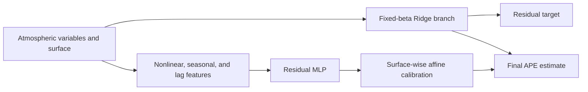
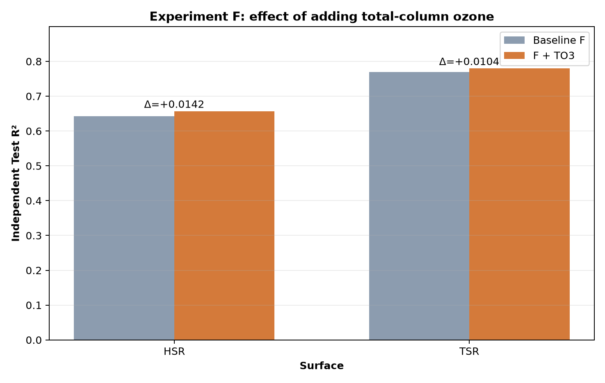

# Fixed-beta residual hybrid for solar-spectrum APE prediction

An interpretable hybrid model for predicting average photon energy (APE) from atmospheric variables. The model combines a surface-conditioned fixed-coefficient Ridge branch, a residual multilayer perceptron (MLP), and validation-only affine calibration.

This repository is the focused, reproducible companion to the model presented at the 2026 Autumn Meeting of the Japan Society of Applied Physics. It reports what was demonstrated on the Tsukuba data, while keeping nationwide transfer as a future validation target.

## Model idea



For surface \(s\in\{\mathrm{HSR},\mathrm{TSR}\}\),

$$
\hat y = \hat y_{\beta} + \operatorname{clip}(a_s\hat r_{\mathrm{MLP}}+b_s).
$$

- **Fixed beta:** a transparent, time-invariant linear baseline estimated with Ridge regression. The coefficients are associations, not universal physical constants.
- **Residual MLP:** learns nonlinear structure that remains after the linear branch.
- **Affine calibration:** estimates residual scale and offset from the later half of validation only. The independent test set is never used for training, model selection, or calibration.

## Independent-test results

The evaluation used 1,822 hourly timestamps per surface in the final chronological test period.

| Surface | Model | R2 | RMSE (meV) | MAE (meV) |
|---|---|---:|---:|---:|
| HSR | Fixed beta | 0.5458 | 15.9204 | 11.5499 |
| HSR | Fixed beta + residual MLP | 0.6365 | 14.2438 | **10.3222** |
| HSR | Hybrid + affine calibration | **0.6567** | **13.8417** | 10.6759 |
| TSR | Fixed beta | 0.6494 | 17.8938 | 13.4278 |
| TSR | Fixed beta + residual MLP | 0.7563 | 14.9186 | 10.5333 |
| TSR | Hybrid + affine calibration | **0.7795** | **14.1903** | **10.3116** |

The residual learner provides most of the improvement. Affine calibration improves R2 and RMSE on both surfaces, but it does not improve every metric: HSR MAE is lower before calibration.

## Controlled TO3 ablation

Adding total-column ozone (`TO3`) to the otherwise identical hourly pipeline changed test R2 by +0.0142 for HSR and +0.0104 for TSR. Day-block paired bootstrap intervals remained above zero, but this result comes from a single training seed and does not establish a causal ozone effect.



The separate three-feature demonstration is retained only as contextual evidence. It differs in training topology, recursive inference, engineered features, and seed, so its performance gap must not be attributed solely to adding Angstrom exponent and TO3.

## Reproduction

Install Python 3.11 or later, then:

```bash
python -m venv .venv
python -m pip install -e ".[dev]"
pytest
```

The complete experiment entry point is `scripts/hourly_hybrid_to3.py`. It accepts input paths as command-line arguments; see `data/README.md` for the data contract. Raw observations are intentionally excluded.

```bash
python scripts/hourly_hybrid_to3.py \
  --hsr /path/to/hsr_ape.pkl \
  --tsr /path/to/tsr_ape.pkl \
  --met-root /path/to/meteorology \
  --aerosol /path/to/aerosol.csv \
  --omega /path/to/tqv.csv \
  --ozone /path/to/to3.csv \
  --include-ozone \
  --output-root outputs \
  --run-name reproduction
```

Only load trusted pickle files.

## Scope and interpretation

- The reported result is a chronological holdout at one site: Tsukuba, Japan.
- HSR and 32-degree TSR are separate observations but share the same timestamp split.
- The hourly target is an arithmetic mean of valid instantaneous APE values and is not identical to APE computed from an hour-integrated spectrum.
- High-APE cases remain systematically underpredicted.
- Transfer to unseen regions without local spectral labels is a research hypothesis, not a demonstrated result.

See `docs/methodology.md`, `docs/evaluation_protocol.md`, `docs/results_and_discussion.md`, and `docs/limitations.md` for details.

## 日本語要約

本リポジトリは、固定係数Ridgeを解釈可能な基準モデルとし、その残差だけをMLPで補正し、独立したValidation区間で表面別アフィン校正を行うAPE予測手法をまとめたものです。筑波の独立Testで、校正後R2はHSR 0.6567、TSR 0.7795でした。全国・未観測地点への転移は未検証であり、今後の検証課題として明示しています。

## License

MIT. Observation data remain subject to their original providers' terms and are not redistributed here.
